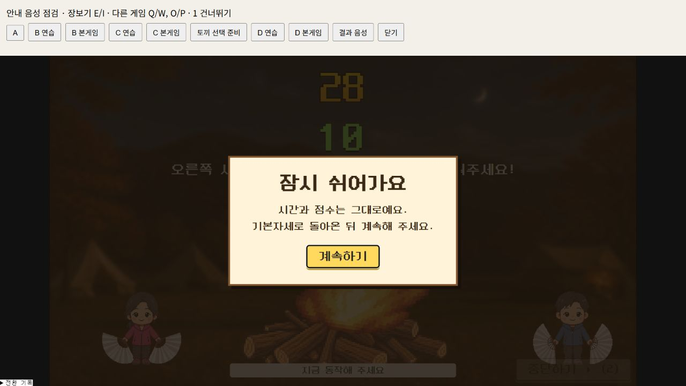

# 일시정지와 청기백기 기록 시각 수정 — 2026-09-30

빠른 검토의 우선순위 1·2를 현재 로컬 작업본에 반영했다.

## 바뀐 동작

- 청기백기·불피우기·떡방아에 ‘잠시 쉬기 (Esc)’와 ‘계속하기’를 추가했다. 연습, 화면 전환, 카운트다운, 본게임, 역할 교대에서 사용할 수 있다.
- 다른 창으로 이동하거나 탭이 숨겨지면 자동 정지한다. 화면으로 돌아오는 것만으로는 재개하지 않는다.
- 남은 시간, 구령, 점수, 완료한 동작을 보존한다. 음성·배경음·카운트다운도 재생 위치를 유지하며 멈춘다.
- 재개 전 기본자세로 돌아오도록 안내한다. 미완성 손동작과 마무리 자세 유지 시간은 새로 시작한다. 일시정지 전에 인정된 동작과 규칙 위반 기록은 보존한다. 정지 중 눌린 키와 계속 누르고 있던 키의 반복 이벤트는 동작으로 세지 않는다.
- 청기백기의 동작 통계 수집도 정지한다. 재개 순간 손을 들고 있다는 이유로 새 동작 횟수를 추가하지 않는다.
- 청기백기는 본게임 시작 시각·시작 당시 입력 모드를 결과까지 전달한다. 첫 구령 전에 중단하거나 결과를 다시 내보내도 시작 시각이 바뀌지 않는다.
- 각 구령을 시작할 때 `구령시작시각`을 저장한다. 서버 trial의 `onset_ts`에도 이 값을 전달한다. 반응 시간은 쉬는 시간을 제외한 게임 시간으로 계산한다.

## 검증

- `npm test` 통과: 공통 11그룹, 떡방아 동작 검사, 음성·화면 진행 17그룹, 장보기 8그룹.
- 정지 중 30~120초를 흘려보내도 타이머와 판정이 진행되지 않는지 검사했다. 음성 종료 이벤트가 정지 직후 도착하거나 파일 로딩이 늦게 끝나는 경우도 포함한다.
- 청기백기 20구령·역할 교대·피드백·0구령 중단, 떡방아 100점 완주·역할 교대·마무리 자세에 일시정지를 끼워 넣어 검사했다.
- TypeScript 검사와 배포용 빌드 통과.
- 에셋 검사: 202개 경로 / 59개 프레임 / 오류 0개. 기존 JPEG 내용의 PNG 확장자 경고 2건은 유지한다.
- 실제 브라우저에서 불피우기 28초 정지 → 유지 → 재개, 떡방아 76초 정지 → 유지 → 다음 구령 진행, 청기백기 연습의 일시정지 화면을 확인했다. 브라우저 오류·경고는 발견하지 못했다.

브라우저 확인은 실제 화면을 불러오는 로컬 점검 페이지를 사용했다. 카메라 요청과 실제 서버 기록 전송은 수행하지 않았다. 실제 두 사람이 카메라 앞에서 하는 현장 시험과 서버 왕복 검증은 남아 있다.

불피우기 미완주 등급 정책과 B/C/D 서버 누적 저장 연결은 이번 수정 범위에 포함하지 않았다.
